Purpose:
========

The purpose of the Automation lab is to introduce participants to
Nutanix REST API’s and developer tools that can be used to exercise the
API’s, view their results, and implement a sequence of API calls in a
script to automate workflows.

Scope:
======

The Automation Lab starts with an introduction to REST, HTTP,
Client/Server architecture, JSON, and an overview of Nutanix REST API
Explorer. The introduction is followed by a set of exercises designed to
walk participants through navigating the REST API Explorer, locating
specific commands, executing the commands, and observing the results
using both the Swagger generated API Explorer (Prism), and Postman
(3^rd^ party API toolchain). Participants will then implement several
commands using cURL.

Requirements:
=============

The following is a list of hardware and software requirements needed to
execute and complete the lab.

#### **Prerequisites**

-   Understanding of HTTP, and REST.

-   Comfortable with Bash/Batch shell scripting, or other programming
    language/runtime.

-   Familiar with both Postman™ and Prism Element™

#### **Hardware**

-   HPOCS Nutanix Hardware

-   Laptop, 10Base-T, CAT5/CAT6 ethernet cable.

#### **Software**

-   Postman™ v4.10.7.

-   Jq© v1.5

-   Windows 2k12 Server™ .iso (smb://pocfs.nutanixdc.local/iso).

REST API Overview
=================

The REST (Web Services) APIs (i.e. WS-API) allow users to author scripts
or integrate with 3^rd^ platform solutions, designed to automate the
execution of system administration commands against a Nutanix endpoint
or resource. The API is designed to expose backend data of a Nutanix
cluster that can be read or written to using Hypertext Transfer Protocol
(HTTP).

#### **Hypertext Transfer Protocol (HTTP)**

The Hypertext Transfer Protocol (HTTP) is an application-level protocol
for distributed, collaborative, hypermedia information systems, and is
the foundation for data communication for the World Wide Web. HTTP is a
generic and stateless protocol which can be used for other purposes
(i.e. Web Services, or RESTful API’s), including extensions of built-in
request methods, error codes, and headers.

HTTP is based on the client-server architecture model and a stateless
request/response protocol that operates by exchanging messages across a
reliable TCP/IP connection.

An HTTP "client" is a program (Web browser, thick-client, script, etc.)
that establishes a connection to a server for the purpose of sending one
or more HTTP request messages. An HTTP "server" is a program (i.e.
Apache web-server running on the CVM) that accepts connections in order
to serve HTTP requests by sending HTTP response messages.

***Client:*** sends a ***request-line*** to the server in the form of a
***request-method***, URI, and ***protocol-version***, followed by a
MIME-like message containing request modifiers, client information, and
possibly ***entity-body*** content (i.e. JSON) over a TCP/IP connection.

***Server:*** responds with a ***status-line***, including the message's
***protocol-version*** and a ***status-code*** (success or error code),
followed by a MIME-like message containing server information, entity
meta information, and possibly ***entity-body*** content (i.e. JSON).

#### **HTTP Uniform Resource Identifier (URI)**

HTTP makes use of the Uniform Resource Identifier (URI) to identify a
given resource and establish a connection. Once the connection is
established, **HTTP messages** are passed between client and server.
These messages include **requests** from client to server
and **responses** from server to client: HTTP-message =
*&lt;Request&gt;* | *&lt;Response&gt;* ; [^1]HTTP/1.1 messages

Uniform Resource Identifiers (URI) are formatted, case-insensitive
strings containing name, location, etc., to identify a resource, for
example, a website, or a web service (i.e. *abs\_path* =
/*PrismGateway/Services/rest/v2.0/vms/*). A general syntax of URI used
for HTTP is as follows:

[^2]URI = “http:” “//” host \[“:” port\] \[abs\_path \[“?” query\]\]

#### **HTTP Request/Response Message**

HTTP request(s) and response(s) use a generic message format for
transferring required data. This generic message format consists of the
following:

**start-line** \[*request-line* | *status-line*\]:

The ***request-line*** is initiated by the client and begins with a
***request-method*** specifying the action to be taken, followed by a
***request-URI*** identifying the resource the action is to be performed
on, and ending with the ***protocol-version*** to determine the
handshaking. The following are list of common [^3]***request-methods***
found in most REST API implementations.

-   **GET:** Retrieves information from a specified server for a given
    URI (resource).

-   **POST:** Sends data to a specified server to create a resource for
    a given URI (resource).

-   **PUT:** Update data for a specified resource for a given URI
    (resource).

-   **DELETE:** Remove a resource instance for a given URI (resource).

e.g. request-line: GET /vms/ HTTP/1.1

A ***status-line*** is initiated by the server and consists of the
***protocol-version*** followed by a numeric ***status-code*** and
associated textual phrase. The ***status-code*** element is a 3-digit
integer where the first digit defines the class of response, and last 2
digits define detail.

-   **1XX:** \[Informational\] Request was received and in-process.

-   **2XX:** \[Success\] Request successfully received understood, and
    accepted.

-   **3XX:** \[Redirection\] further action is required to complete
    request

-   **4XX:** \[Client Error\] request contains incorrect syntax or can’t
    be fulfilled.

-   **5XX:** \[Server Error\] server failed to fulfill the request.

e.g. status-line: HTTP/1.1 200 OK

**header** \[field-name “:” \[field-value\]\]:

The header provides information that qualifies the request or response
messages, to include the **message-body** (assuming it exists). Header
**field-names** and **field-values** vary depending on if the message is
a request or response, and if there’s a **message-body** attached:

**message-body** (optional):

The ***message*** carries the **entity-body** associated with the
request or response. If **entity-body** is present,
**content-type **and **content-length** header lines specify the nature
of the body (in the context of a REST API’s ***content-type***:
application/json, ***content-length***: size of JSON in bytes).

#### 

#### **JSON Message-Body**

Both the request and response message payloads in REST API
implementations use a lightweight, self-describing data-interchange
referred to as ***JavaScript Object Notation*** (JSON) used to structure
data (as text) composed of objects containing &lt;*key,value&gt;* pairs,
or arrays of objects. Since JSON format is text, it can easily be sent
to and from a server, and consumed by any programming language.

JSON syntax is derived from ***JavaScript Object Notation*** syntax
where:

-   Data is organized using *key,value* pairs, and separated by commas
    (*“,”*).

-   Curly braces *(“{“, “}”)* hold objects containing *key,value* pairs.

-   Square brackets (\[ \]) hold arrays of objects.

A *key/value* pair consists of a field name (in double quotes), followed
by a colon, followed by a value: e.g. "model":"nx3160". In
JSON, *values* must be one of the following data types:

-   String (values are in double quote “ ” notation)

-   Number (must be integer or floating point)

-   Object (surrounded by curly bracket { } notation. Can have embedded
    objects.)

-   Array (square bracket \[ \] notation, indexed by integers starting
    at 0)

-   Boolean (literal: true or false)

-   Null (written as null)

The following JSON example defines a Nutanix “disks” array, containing 3
“disk” objects:

{“disks":\[\
   
{“disk”:{ "vendor":"seagate", "type":"hdd", "capacity":8000000000000,“encrypted”:
false}, “device\_bus”=”scsi”},\
   
{“disk”:{ "vendor":"seagate", "type":"hdd", "capacity":8000000000000,“encrypted”:
false}, “device\_bus”=”scsi”},\
    {“disk”:{ "vendor":"toshiba", "type":"ssd", 
"capacity":1200000000000,“encrypted”: false}, “device\_bus”=”scsi”}\
\]}

Nutanix REST API Explorer Overview
==================================

The Nutanix **REST API Explorer** is written and formatted using an API
framework called Swagger (governed by Apache license v2.0), used to
describe and document RESTful APIs. The framework generates an
interactive API document users can visualize and interact with, which
Nutant’s commonly refer to as the Nutanix **REST API Explorer**.

The explorer is an expandable/collapsible, interactive hypertext
document, organized by top-level resources (i.e. **images, vms, hosts,
storage containers**, etc…), and their associated HTTP request
operations (i.e**. GET, POST, DELETE, PUT**). When a resource operation
is expanded, consumers are provided with descriptions, JSON Model
definitions, and request/response panes for viewing messages and header
and information.

Users navigate the explorer by scanning the document for a top-level
resource (i.e. **vms**) they want to perform work on. Once a resource
has been located, users can then expand the resource by performing a
*mouse-click* on the resource name, exposing the supported HTTP request
operations. Users can then interact with, and manipulate a resource
instance using a given request operation from within the explorer view.

#### 

#### **REST API Explorer - JSON Message-Body Declaration – POST /vms/**

The following illustration shows a message-body formatted in JSON used
for creating a Virtual Machine (VM) using POST as defined using the
Nutanix **REST API Explorer**.

#### **REST API Explorer - JSON Message Response Header – POST /vms/**

The following illustration shows a message-body formatted in JSON for
creating a Virtual Machine (VM) using POST from within the Nutanix
**REST API Explorer**.

\
=

REST API Explorer Exercise
==========================

In this section, participants will navigate the Nutanix REST API
Explorer, execute a subset of API commands, and interpret their results.

The goal and/or objectives of this exercise include:

-   Learn how to navigate and interact with the **REST API Explorer**.

-   Understand how to locate REST endpoints, resources, and their
    associated operations (i.e. GET, POST, DELETE, and PUT).

-   Learn how to successfully manage the lifecycle of a VM using HTTP
    request operations (i.e. GET, POST, DELETE, and PUT), and interpret
    their response and/or status codes.

-   Learn how to apply requirements, and collect associated resource
    data to construct JSON needed for VM creation.

**Steps**:

1.  In this sequence of tasks, participants will prepare the AOS+AHV
    environment by creating a storage container labeled **ISOs**, and
    uploading the Windows™ Server 2012 R2 and Nutanix Virt-IO ISO images
    to the **ISOs** storage container needed for VM creation.

> **Note:** If you’ve previously created the **ISOs** storage container
> and uploaded the .iso images, you may skip this task sequence and move
> on the to the next step.

a.  Start a Prism™ Element Console session opening a browser instance
    and connect to Prism Element’s target IP address: e.g.
    <https://10.68.69.102:9440>.

b.  From the dashboard pulldown menu, select the **Storage** dashboard

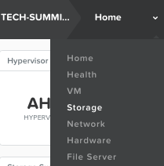

a.  Create a storage container to persist the Windows ™ and NGT virt-io
    .iso images by performing a mouse-click on the **+ Storage
    Container** button

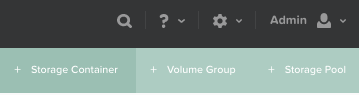

a.  In the Create Storage Container dialog box, create a container named
    **ISOs** from the default storage pool. Click the Save button when
    done.

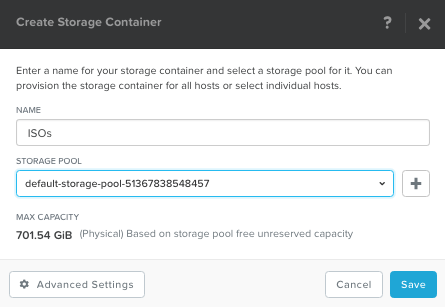

1.  Upload the Windows™ .iso image to the **ISOs** container

    a.  From the Gear icon menu, select the **Image Configuration** link

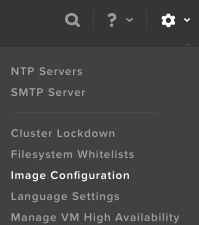

a.  In the Image Configuration dialog box, mouse-click the +Upload Image
    button

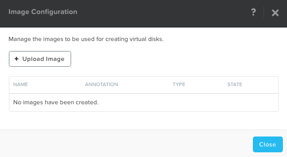

a.  In the Create Image dialog box, complete the fields as shown below:

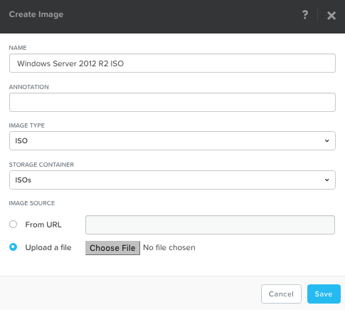

a.  Mouse-click **Choose File** button.

b.  Select the Windows™ ISO file from the location where you saved it
    to.

c.  Mouse-click **Save** button.

d.  Repeat Step-2, substituting Windows™ .iso image with NGT virt-io
    .iso image.

<!-- -->

1.  In this step, you’ll locate and launch the **REST API Explorer**.

    a.  From the Prism™ UI, select **REST API Explore**r link from the
        **Admin** dropdown menu:

> 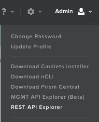

3.  In the next set of tasks, you’ll locate the **vms** resource in the
    **REST API Explorer**, and issue the GET **/vms/** API command to
    retrieve all of the configured VM’s in the cluster. This is a
    check-point to quickly inventory what VM’s currently exist. Its
    recommended participants delete any existing VM’s using Prism™
    before proceeding…

    a.  Using the **REST API Explorer**, locate the **vms** resource and
        mouse-click List Operations to expand.

    b.  The Explorer should appear as follows:

> 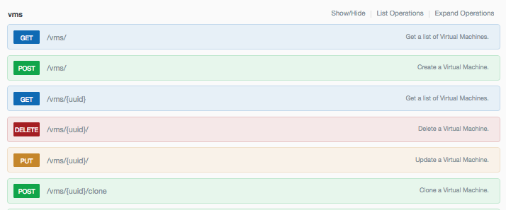

a.  Mouse-click **GET /vms/** to expand the operation. The page should
    appear as follows:

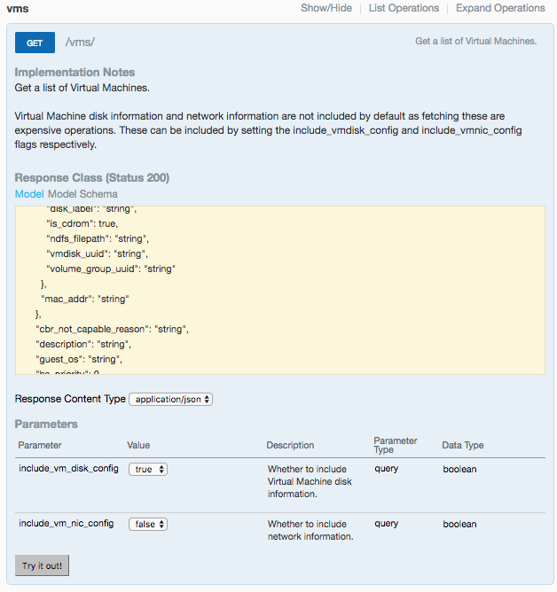

a.  Mouse-click the **Try it out!** button to issue an HTTP GET
    **/vms/** request.

    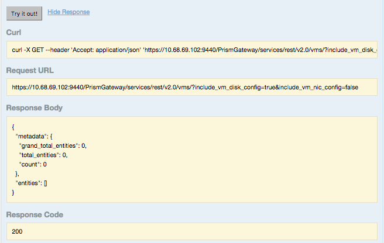

b.  The **Response Body** (shown above) should show a *key:value* of
    “count”:0 with a **Response-Code** 200 (Reference Appendix C for
    additional Response Codes).

    EXPECTED RESULTS: “count”:0 //indicates \#of VM’s configured.

<!-- -->

3.  In the following sequence of tasks participants will create and
    validate a POST **/vms/** JSON **message-body** used as a template
    to define a Windows™ Guest VM.

    a.  We’ll start this exercise by modeling our JSON **message-body**
        using the template provided below. The template is a subset of
        the overall model scheme, containing a minimum-set of data
        needed for VM creation. Template verification is required to
        insure we start with a known working model. JSON verification
        can be achieved using a [JSON
        Validator](https://jsonformatter.curiousconcept.com/) tool. Copy
        and paste the scheme below into the **JSON FORMATTER &
        VALIDATOR** tool textbox and mouse-click the **Process** button.

        \*\*\*CUT-N-PASTE JSON SCHEME BELOW\*\*\*

> {"description":"test","guest\_os":"string","memory\_mb":0,"name":"string","num\_cores\_per\_vcpu":0,"num\_vcpus":0,"vm\_disks":\[{"disk\_address":{"device\_bus":"ide","device\_index":0},"is\_cdrom":true,"is\_empty":false,"vm\_disk\_clone":{"disk\_address":{"vmdisk\_uuid":"string"}}},{"disk\_address":{"device\_bus":"scsi","device\_index":0},"vm\_disk\_create":{"storage\_container\_uuid":"string","size":0}},{"disk\_address":{"device\_bus":"ide","device\_index":1},"is\_cdrom":true,"is\_empty":false,"vm\_disk\_clone":{"disk\_address":{"vmdisk\_uuid":"string"}}}\],"hypervisor\_type":"ACROPOLIS","affinity":null}
>

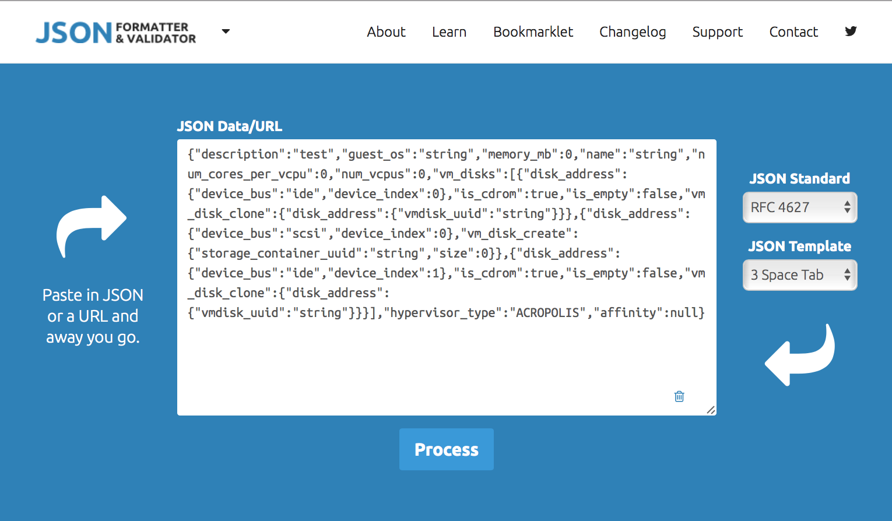

a.  The results should appear as follows:

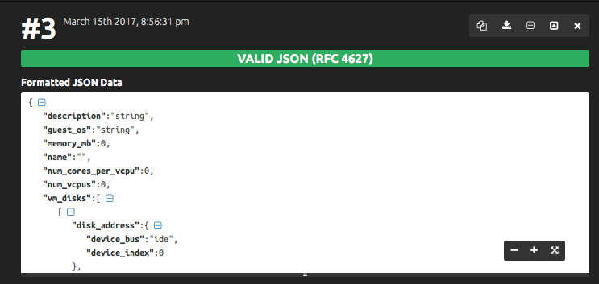

a.  Make the recommended changes as needed.

b.  Repeat steps ‘a’ - ‘c’ until JSON is valid.

c.  Using the **REST API Explorer**, locate and expand the **vms**
    resource (if needed). Search for the POST **/vms/** API. Once found,
    mouse-click to expand the POST operation.

d.  Copy the validated JSON from the **Formatted JSON Data** textbox and
    paste it into the JSON **message-body** of the POST **/vms/** API as
    shown:

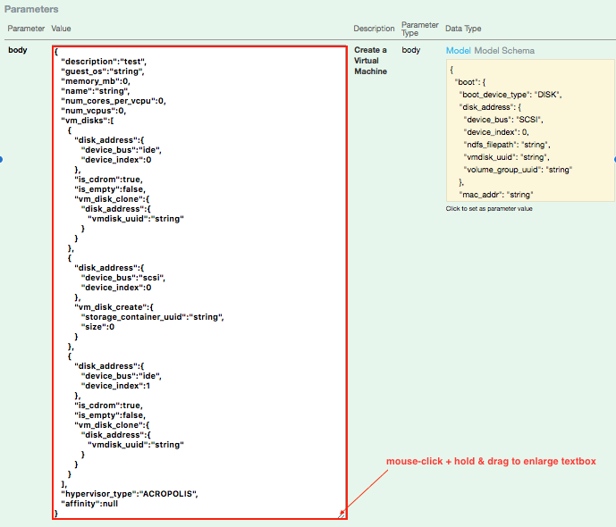

3.  In the next set of tasks, we’ll begin constructing the JSON
    **message-body**. The **message-body** defines the VM’s name,
    compute, core-count, memory, and references to both the image and
    storage-container resources needed for VM imaging and VM runtime.
    We’ll begin by collecting the required storage-container and image
    resource references (i.e. UUIDs) for VM DISK and STORAGE CONTAINER
    id’s.

    a.  Using the **REST API Explorer**, locate the
        **storage\_containers** resource and mouse-click List Operations
        to expand.

    b.  The Explorer should appear as follows:

    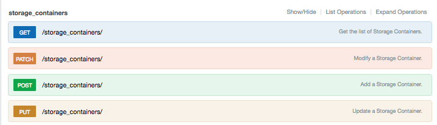

a.  Mouse-click **GET /storage\_containers/** API to expand the
    operation.

b.  Mouse-click the **Try it out!** button to issue an HTTP GET
    **/storage\_containers/** request.

c.  Verify the request executed successfully by checking for a
    **Response Code** of 200 (Reference Appendix C for additional
    Response Codes as needed for debug).

    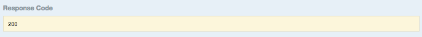

d.  Scroll through the **Response Body** and locate the storage
    container instance with *key:value* “name”:”default-container-NNN”,
    where ‘NNN’ is a long sequence of integers.

e.  Once you’ve located *key:value* “name”:”default-container-NNN”,
    where ‘NNN’ is a sequence of integers, copy the **value**
    corresponding to the “storage container uuid” *key*. Paste the
    **value** to notepad for future use.

    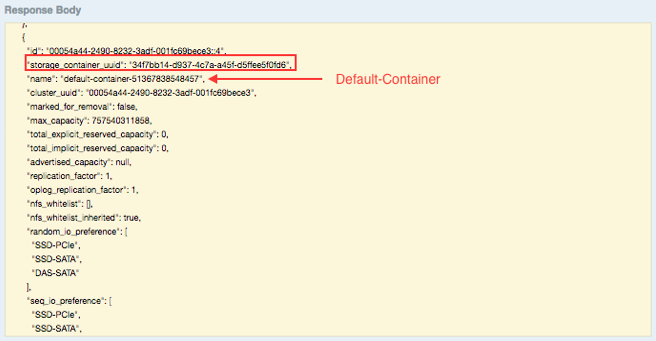

***NOTE:*** The **value** will be used for the “storage container uuid”
*key:value* within the POST **/vms/** JSON **message-body.**

a.  Continue to scroll through the **Response Body** and locate the
    storage container instance with *key:value* “name”:”ISOs”.

b.  Once *key:value* “name”:”ISOs” has been located, copy the **value**
    corresponding to the “storage container uuid” *key*. Paste the
    **value** to notepad for future use…

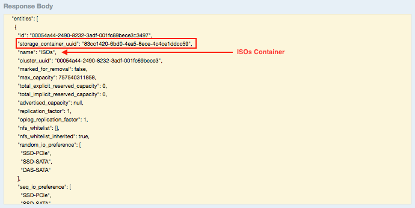

> ***NOTE:*** The **value** will be used for referencing the “storage
> container uuid” *key:value* within the GET **/images/** resource
> **Response Body.**

a.  Now we’ll need to locate the **vmdisk** references for each of the
    .iso images we created earlier using Prism™ Image Services. These
    .iso images are needed to create the Windows™ Guest VM, and are
    located in the **images** resource.

b.  Using the **REST API Explorer**, locate the **images** resource and
    mouse-click List Operations to expand.

c.  The Explorer should appear as follows:

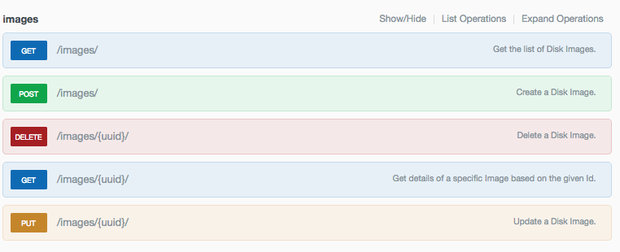

d.  Mouse-click the **GET /images/** API to expand the operation.

e.  Mouse-click the **Try it out!** button to issue an HTTP GET
    **/images/** request.

f.  Verify the request executed successfully by checking for a
    **Response Code** of 200 (Reference Appendix C for additional
    Response Codes if needed for debug).

> {width="5.096061898512686in"
> height="0.5120374015748032in"}

o.  Scroll through the **Response Body** and locate
    “storage\_container\_uuid” *key* and cross-reference its **value**
    with the **value** previously discovered and saved for the
    **storage\_container** resource instance ***ISOs***
    “storage\_container\_uuid” *key*.

p.  Once a match has been found, cross-reference the **image** resource
    instance *key:value(s)*: “name”:”Nutanix Virt-IO”, and
    “name”:”Windows Server 2012 R2”. Copy and paste the **values** for
    each “vm\_disk\_id” *key* to notepad, tagging each **value** with
    the corresponding **image** resource instance “name”.

> {width="5.406049868766404in"
> height="2.7111111111111112in"}

o.  Now we can complete the construction of the POST **/vms/** JSON
    **message-body.** Using the **REST API Explorer**, locate and expand
    the **vms** resource (if needed). Expand the POST **/vms/** API (if
    needed). Edit the **JSON message-body** template using the following
    values:

    Description : Tech Summit 2017

    guest\_os : Windows Server 2012 R2

    memory\_mb : 4096 (MB)

    name : W2K12R2

    num\_cores\_per\_vcpu : 2

    num\_vcpus : 1

    vm\_disk\_0: **\[CDROM mounted w/Windows™ Server 2012 R2 ISO\]**

    device\_bus : ide (IDE Device)

    device\_index : 0 (BUS ADDR: 0)

    is\_cdrom : true (CDROM: true)

    is\_empty : false (CDROM: has ISO)

    vm\_disk\_clone :

    disk\_address :

    vmdisk\_uuid : \[vmdisk\_id from image resource instance - windows
    iso\]

    vm\_disk\_1: **\[Container/Datastore to be provisioned from Default
    Storage Pool\]**

    device\_bus : scsi (SCSI Device)

    device\_index : 0 (BUS ADDR: 0)

    vm\_disk\_create :

    storage\_container\_uuid: \[uuid from “default” storage\_container
    res instance\]

    size : 10737418240 (BYTES)

    vm\_disk\_2: **\[CDROM mounted w/Nutanix Virt-IO ISO\]**

    device\_bus : ide (IDE Device)

    device\_index : 1 (BUS ADDR: 1)

    is\_cdrom : true (CDROM: true)

    is\_empty : false (CDROM: has ISO)

    vm\_disk\_clone :

    disk\_address :

    vmdisk\_uuid : \[vmdisk\_id from image resource instance - virt-io
    iso\]

p.  The POST **/vms/** JSON **message-body** should look as follows:

> {width="5.264583333333333in"
> height="4.891193132108486in"}

o.  The final JSON **message-body** needs to be verified prior to
    issuing an HTTP POST **/vms/** request. Verification can be achieved
    using a [JSON Validator](https://jsonformatter.curiousconcept.com/)
    tool. Copy and paste the JSON **message-body** into the **JSON
    FORMATTER & VALIDATOR** tool textbox and mouse-click the **Process**
    button. Make edits as needed. Repeat validation until successful.

> ***Note:*** If there were corrections to the JSON, copy the entire
> JSON body from the validator and paste it into the POST **/vms/** JSON
> **message-body**.

o.  Once the JSON has successfully completed validation, mouse-click the
    **Try it out!** button to issue an HTTP POST **/vms/** request.

p.  Verify the HTTP POST **/vms/** request was successful by verifying
    **Response code** 201.

> {width="5.220833333333333in"
> height="1.3083333333333333in"}

o.  Verify the VM can be read using the GET **/vms/** API. Using the
    **REST API Explorer**, Navigate to GET **/vms/** API, and
    mouse-click the **Try it out!** button to issue an HTTP GET
    **/vms/** request. The page should look similar as follows:

> {width="5.18125in"
> height="2.558108048993876in"}

o.  Verify the new VM is visible in Prism™ Element.

> {width="5.18125in"
> height="1.4652777777777777in"}

3.  In the following sequence of tasks, participants will power the
    Windows Guest VM ON/OFF using the POST
    **/vms/{uuid}/set\_power\_state/** API. We’ll first verify the
    current power-state of the Guest VM, and capture the Guest VM UUID
    to be used as a parameter for issuing the HTTP POST
    **/vms/{uuid}/set\_power\_state/** request.

    a.  Using the **REST API Explorer**, navigate to **vms** resource
        and mouse-click List Operations to expand (if needed).

    b.  Navigate to GET **/vms/** API, and mouse-click the **Try it
        out!** button to issue an HTTP GET **/vms/** request.

    c.  Scroll through the **Response Body** to verify the Windows Guest
        VM Power State is “off”. Copy the VM’s “uuid” key value and
        paste it to notebook or clipboard for future reference.

        {width="5.347691382327209in"
        height="2.9055555555555554in"}

    d.  Navigate to POST **/vms/{uuid}/set\_power\_state/**, and
        mouse-click the API to expand (if needed).

    e.  Click on the **Model** textbox to move the scheme to the JSON
        **message-body.**

    f.  Paste the VM’s “uuid” key value in the “uuid” key value field of
        the JSON **message-body,** to include the **uuid** textbox
        field. Set the “transition” key value to “ON”. Remove host\_uuid
        key from the JSON **message-body.**

> {width="5.429861111111111in"
> height="4.655555555555556in"}

a.  Mouse-click **Try it out!** button to issue an POST
    **/vms/{uuid}/set\_power\_state/** request. Verify **Response Code**
    (201).

    {width="5.431025809273841in"
    height="1.4842596237970254in"}

b.  Verify the Windows Guest VM Power State has changed using the **REST
    API Explorer**. Navigate to GET **/vms/** API and expand (if
    needed). Mouse-click the **Try it out!** button to issue an HTTP GET
    **/vms/** request.

c.  Verify **Response Code** 200. Scroll through the Response Body to
    verify Power State reflects “ON”.

> {width="5.201257655293088in"
> height="3.0629625984251967in"}

a.  Verify the VM power state is visible and powered on in Prism™
    Element.

> {width="5.18125in"
> height="1.7291666666666667in"}

a.  To power off the Windows Guest VM, use the **REST API Explorer** to
    navigate back the POST **/vms/{uuid}/set\_power\_state/** API, and
    click to expand (if needed).

b.  Edit the power state in the JSON **message-body** from “ON” to
    “OFF”. Be sure the **uuid** represents the correct VM target to be
    powered down.

> {width="5.2644116360454944in"
> height="1.6729910323709536in"}

a.  Mouse-click **Try it out!** button to issue POST
    **/vms/{uuid}/set\_power\_state/** request. Verify **Response Code**
    201 to insure the command executed successfully.

b.  Using the **REST API Explorer**, navigate to GET **/vms/** API and
    expand (if needed). Mouse-click **Try it out!** button to issue HTTP
    GET **/vms/** request. Check that the Windows Guest VM power-state
    is “off”.

> {width="5.452646544181977in"
> height="3.442592957130359in"}

3.  In the following sequence of tasks, participants will delete the
    Windows Guest VM using the REST API.

> **Note:** DELETE destroys the VM using the VM’s uuid inline as part of
> the URI. There’s no JSON **message-body** to edit. The DELETE command
> also gives the user the option to delete any existing snapshots, and
> will continue even if the VM is powered ON, making the DELETE
> operation an idempotent action.

a.  Using the **REST API Explorer**, navigate to DELETE **/vms/{uuid}/**
    and expand (if needed).

b.  Paste the target VM’s “uuid” key value in the “uuid” field, and
    mouse-click the **Try it out!** button to issue HTTP DELETE
    **/vms/{uuid}/** request.

> {width="5.514583333333333in"
> height="5.853841863517061in"}

a.  Using the **REST API Explorer**, navigate to GET **/vms/** API and
    expand (if needed). Mouse-click the **Try it out!** button to issue
    an HTTP GET **/vms/** request. Verify that the Windows™ Guest VM has
    been deleted.

> {width="5.43125in"
> height="3.482638888888889in"}

a.  Verify the VM is no longer visible in Prism™ Element.

> {width="5.43125in"
> height="1.9666666666666666in"}

Postman Exercise
================

In the following set of tasks, you will learn to combine the Nutanix
REST API Explorer generated URL and JSON scheme’s with Postman to
**C**reate, **R**ead, **U**pdate, and **D**elete a Windows™ Server 2012
R2 VM using REST API’s.

The goal and/or objectives of this exercise include:

-   Learn how to use Postman to issue REST requests.

-   Create Collections of REST API commands within Postman,
    Import/Export the Collections.

-   Learn how to Autorun and test REST API commands within Postman.

-   Learn how to generate code from Postman Collections.

1.  Setup

    a.  Create a directory “postman” on your local filesystem.

    b.  Under the postman directory create the following subdirectories:

        i.  postman.collections

        ii. postman.testrun

    c.  Copy the Postman archive/installer from the student-kit (flash
        drive) to the new postman directory.

> **Note:** If on Mac OSX, unzip the bundle in the directory. If windows
> run the “setup” installer.

a.  Once installed and or unzipped, launch postman. On Mac OSX you might
    see the following:

> {width="4.18125in"
> height="1.2708333333333333in"}

a.  Click “Open” to proceed.

b.  Postman should launch successfully

c.  In some instances, you might see an Update request. Proceed by
    clicking “Remind me later” button and continue.

d.  It’s recommended (but not required) to create an account to leverage
    some of the more advanced Postman features. If you have an account
    or choose to create one, click the “Sign In” button in the upper
    right of Postman’s main landing page and follow the steps provided
    by Postman. Otherwise proceed to the next step and use as-is.

> {width="3.93125in"
> height="0.41944444444444445in"}

a.  Disable SSL Certificates by navigating Postman Main Menu and select
    “Preferences”.

> {width="1.5979166666666667in"
> height="1.7527777777777778in"}

a.  Toggle “SSL certificate verification to “off”. Insure other settings
    are the same as follows:

> {width="4.514583333333333in"
> height="2.8453707349081365in"}

a.  Once settings have been changed, restart Postman.

> **Note:** For additional document on using Postman, click the wrench
> icon in the upper right and select “Documentation”.

**\
**

1.  Creating Postman collections. In this section, we’ll explore the
    creation of collections within Postman that can be leveraged to
    simplify the execution of REST APIs using Postman’s main application
    pane.

> **Note:** A collection lets you group individual requests together.
> These requests can be
>
> further organized into folders to accurately mirror the API. Requests
> can also store sample responses when saved in a collection. You can
> add metadata like name and
>
> description too so that all the information that a user needs to use
> the API is easily accessible.

a.  Start collection creation by clicking on “Collections” and the
    clicking the “Create New Collection Icon”.

> {width="1.8756255468066492in"
> height="1.4935181539807525in"}

a.  Enter the collection Name “Nutanix” and a brief description as show
    below. Click **Create** button to save.

> {width="2.93125in"
> height="3.3941119860017497in"}

a.  Create a subfolder under the Nutanix collection, by clicking the
    ellipses to access the dropdown menu and select **Add Folder**

> {width="1.387020997375328in"
> height="2.9379625984251967in"}

a.  Create the Add Folder by adding the name ‘*V2:Images’*, followed by
    a brief description, and then click **Create** button to save.

> {width="3.43125in"
> height="3.9562029746281713in"}

a.  Repeat steps **c** & **d** to create the following subfolders

    i.  V2:VMS

    ii. V2:StorageContainers

b.  Results should appear as follows:

> {width="3.0145833333333334in"
> height="2.8582075678040244in"}

a.  Now we’ll add requests (i.e. Nutanix REST APIs) to our newly created
    collection folders. This is accomplished using the following
    workflow:

    i.  Navigate the **Nutanix V2 REST API Explorer** to find the target
        API to be added to a Postman collection.

    ii. Execute the API within the REST API Explorer. Copy the **Request
        URL** and paste to Postman’s execution tab.

    iii. Select **Basic Authentication** within Postman and enter the
        Prism console’s username and password.

    iv. Select the appropriate HTTP request type (i.e. GET, POST, etc…)
        within Postman and click **Send. **

> **Note:** If executing a POST command, a JSON body will need to be
> entered in Postman to do work on a target resource instance.

i.  Upon successful execution, click **Save** button and save the
    command to the proper collection folder.

<!-- -->

a.  Login into Prism Element, click **Admin**, and select REST API
    Explorer from the dropdown menu.

> {width="1.7390266841644795in"
> height="2.0629625984251967in"}

a.  From the REST API Explorer, find the “GET /VMS/” API request and
    execute the API by clicking **Try it out!** button.

b.  Upon successful execution (Response code: 200), copy the Request URL
    and paste it to Postman’s execution tab.

> REST API Explorer – Copy Request URL:
>
> {width="5.264583333333333in"
> height="0.58125in"}
>
> Postman Execution tab – Paste URL:
>
> {width="5.264583333333333in"
> height="0.7840277777777778in"}

a.  Within Postman, click **Authorization** link, select type **Basic
    Auth.** Add Prism Elements *username* and *password* to their
    appropriate fields, and check **“Save helper data to request”**

> {width="5.597916666666666in"
> height="2.160184820647419in"}

a.  Within Postman, insure **GET** is the selected HTTP request type,
    click **Send** button, and check for successful execution (Status:
    200 OK).

> {width="5.43125in"
> height="2.6555555555555554in"}

a.  Upon successful execution, click Save button. A Modal Dialog titled
    **SAVE REQUEST** should appear with the **Request Name**
    prepopulated with the Request URL that was just executed. Add a
    **Request description**, and click **Save to existing collection /
    folder**. Select Nutanix, and then V2:VMS. Click **Save** button
    when completed to save and close dialog.

> {width="3.266524496937883in"
> height="4.095370734908136in"}

a.  The Collections within Postman should now show the new request added
    to folder ***Nutanix, V2:VMS*** .

> {width="2.43125in"
> height="2.7656342957130358in"}

a.  Complete the following GET request operations using the REST API
    Explorer, and adding them to their appropriate Postman
    **Collection** folders.

    i.  GET StorageContainers (Nutanix--&gt;V2:StorageContainers)

    ii. GET Images (Nutanix--&gt;V2:Images)

b.  Using the REST API Explorer, navigate to, and expand the **POST
    /vms/** API, define the JSON body, and execute the POST request.

> **Note:** Assuming you’ve successfully completed adding **GET
> /images/** and **GET /storage\_containers/** to Postman Collections,
> you can execute those requests within Postman by selecting the
> appropriate collection and clicking **Send** button to get the needed
> &lt;key,value&gt; pairs to build the **POST /vms/** JSON body.

a.  Upon successful execution of the of the POST /vms/ command from the
    REST API Explorer, copy the Request URL to Postman Execution tab.
    Set the HTTP Request type to POST.

> {width="5.43125in"
> height="1.1340277777777779in"}

a.  Configure **Authorization Type** within Postman by selecting **Basic
    Auth**. Insure the username and password is set correctly, and
    **Save helper data to request** checkbox is checked.

> {width="5.430225284339458in"
> height="2.9518514873140855in"}

a.  Within Postman, click on **Body**, click **raw**, and click **text**
    to select **JSON (application/json)** from the dropdown menu.

> {width="5.43078302712161in"
> height="3.192592957130359in"}

a.  Within the REST API Explorer, copy the **JSON body** used to create
    the VM to the text field within Postman’s execution pane, and click
    **Send** button.

> {width="5.347916666666666in"
> height="3.657638888888889in"}

a.  The results should look similar as follows with a status of 201
    Created:

> **Note:** The task\_uuid will most likely look different
>
> {width="5.264583333333333in"
> height="3.673611111111111in"}

a.  Upon successful execution, click Save button. A Modal Dialog titled
    **SAVE REQUEST** should appear with the **Request Name**
    prepopulated with the Request URL that was just executed. Add a
    **Request description**, and click **Save to existing collection /
    folder**. Select Nutanix, followed by V2:VMS. Click **Save** button
    when completed to save and close dialog.

> {width="3.597916666666667in"
> height="4.531606517935258in"}

a.  Repeat the steps above to add the following requests to their
    respective collection folder:

    i.  POST /vms/{uuid}/set\_power\_state (Nutanix--&gt;V2:VMS)

    ii. Delete /vms/{uuid}/ (Nutanix--&gt;V2:VMS)

b.  When complete, the Postman Nutanix collections should show 6
    requests, and structured as follows:

> {width="1.969116360454943in"
> height="3.1555555555555554in"}

a.  At this point you should be able to run the various requests within
    Postman. And view the data as needed.

> **Note:** Please take the time to run the commands/requests within
> Postman to get an understanding of how to execute commands and view
> the results.

cURL (Terminal mode)
====================

In the following set of tasks, you will learn to leverage the
Collections and Requests created in Postman to generate cURL code that
can be ran from a terminal.

Once you’ve finalized and saved your requests in a Postman Collection,
you might want to make the same request from your own application.
Postman lets you generate snippets of code in various languages and
frameworks that will help you do this. You’ll need to click the
**Generate Code** link under the blue Send button to access this
feature.

1.  Generate cURL code from existing requests within a Postman
    Collection

    a.  Using Postman, select your **Nutanix collection** defined from
        the previous tasks.

    b.  Select the **GET** request in **Nutanix/V2:VMS**, and the click
        **Code** under the **Save** button next to the blue **Send**
        button.

> {width="5.514583333333333in"
> height="3.372916666666667in"}

a.  Select **cURL** from the dropdown menu. Add “--insecure” just after
    the curl command and before the –X. Click **Copy to Clipboard**
    button

> **Note:** --insecure is required since we’re not using certificates…
>
> {width="5.0966786964129485in"
> height="1.2481485126859142in"}

a.  Open a terminal (windows: cmd) session and paste the clipboard
    content to the command line, and hit enter. The cURL command should
    execute, generating the following output:

> {width="5.416501531058618in"
> height="3.808333333333333in"}

a.  The above is raw output from curl, and represents JSON as a string.

b.  In this exercise you should generate curl commands using Postman for
    each of the requests in the Nutanix Collection you’ve created.

    i.  Read the Storage Containers using - GET storage\_containers

    ii. Read the images using - GET images

    iii. Read the VM’s using - GET vms

    iv. Create a VM using - POST vms

    v.  Power ON/OFF a VM using - POST vms/(uuid}/set\_power\_state
        \[on|off\]

    vi. Delete a VM using - DEL vms/{uuid}

Appendix A – HTTP Response Codes (subset):
==========================================

  -------------------------------------------------------------------------------------------------------------------------------------------------------------------------------------------------------------------------------------------------------------------------------------------------------------------------------------------------------------------------------------------------------------------------------------------------------------------------------------------------------------------------------------------------------------------------------------------------------------------------------------------------------------------------------------------------------------------------------------------------------------------------------------
  **HTTP STATUS CODES**
  ----------------------- ----------------------- -------------------------------------------------------------------------------------------------------------------------------------------------------------------------------------------------------------------------------------------------------------------------------------------------------------------------------------------------------------------------------------------------------------------------------------------------------------------------------------------------------------------------------------------------------------------------------------------------------------------------------------------------------------------------------------------------------------------------------------
  **CODE**                **DEFINTION**           **DESCRIPTION**

  200                     OK                      The request has succeeded. The information returned with the response is dependent on the method used in the request, for example:
                                                  
                                                  -   GET an entity corresponding to the requested resource is sent in the response;
                                                  
                                                  -   HEAD the entity-header fields corresponding to the requested resource are sent in the response without any message-body;
                                                  
                                                  -   POST an entity describing or containing the result of the action;
                                                  
                                                  -   TRACE an entity containing the request message as received by the end server.
                                                  

  201                     Created                 The request has been fulfilled and resulted in a new resource being created. The newly created resource can be referenced by the URI(s) returned in the entity of the response, with the most specific URI for the resource given by a Location header field. The response SHOULD include an entity containing a list of resource characteristics and location(s) from which the user or user agent can choose the one most appropriate. The entity format is specified by the media type given in the Content-Type header field. The origin server MUST create the resource before returning the 201 status code. If the action cannot be carried out immediately, the server SHOULD respond with 202 (Accepted) response instead.

  400                     Bad Request             The request could not be understood by the server due to malformed syntax. The client SHOULD NOT repeat the request without modifications.

  401                     Unauthorized            The request requires user authentication. The response MUST include a WWW-Authenticate header field (section 14.47) containing a challenge applicable to the requested resource. The client MAY repeat the request with a suitable Authorization header field (section 14.8). If the request already included Authorization credentials, then the 401 response indicates that authorization has been refused for those credentials. "HTTP Authentication: Basic and Digest Access Authentication".

  404                     Not Found               The server has not found anything matching the Request-URI.

  500                     Internal Server Error   The server encountered an unexpected condition which prevented it from fulfilling the request.
  -------------------------------------------------------------------------------------------------------------------------------------------------------------------------------------------------------------------------------------------------------------------------------------------------------------------------------------------------------------------------------------------------------------------------------------------------------------------------------------------------------------------------------------------------------------------------------------------------------------------------------------------------------------------------------------------------------------------------------------------------------------------------------------

INTENTIONALLY LEFT BLANK

[^1]: HTTP uses a **&lt;major&gt;.&lt;minor&gt;** numbering scheme to
    indicate versions of the protocol. The version of an HTTP message is
    indicated by an HTTP-Version field.

[^2]: If **port** is empty or not given, port 80 is assumed for HTTP.
    Empty **abs\_path** is equivalent to "/".

[^3]: Should always be in uppercase.
